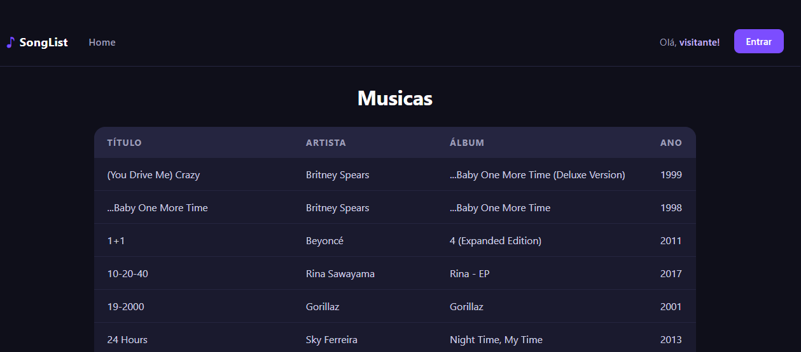
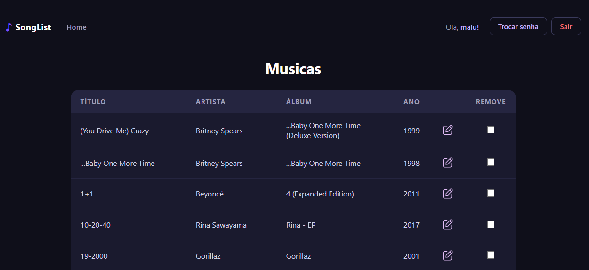
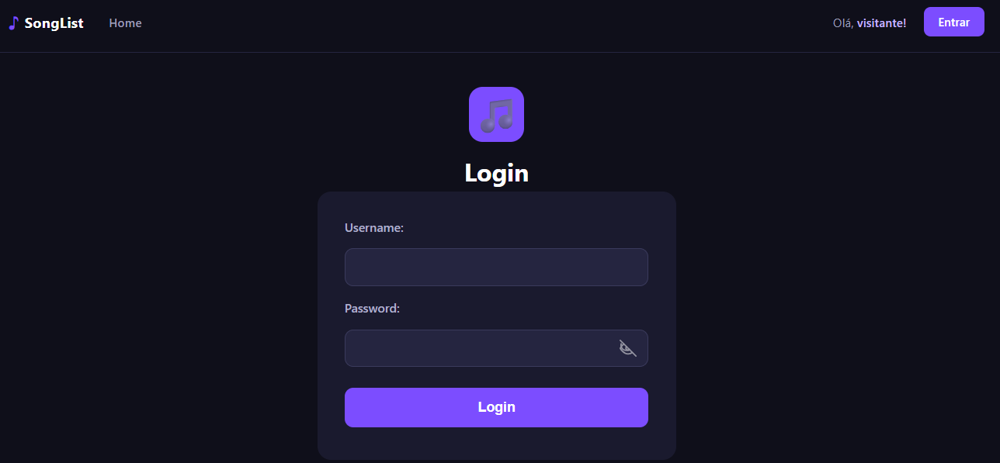

# SongList — Frontend

Trabalho 2 de **INF1407 – Programação para Web** (PUC-Rio, 2026/1).
Interface web em HTML + CSS + TypeScript que consome a API REST do backend [INF1407-TRABALHO2-BACKEND](https://github.com/MaluDutra/INF1407-TRABALHO2-BACKEND).

## Autoria

- Érica Régnier
- Maria Luiza Dutra

## Descrição do projeto

O **SongList** é um catálogo colaborativo de músicas. Este repositório contém o frontend da aplicação: um site estático em HTML/CSS/TypeScript que consome os endpoints REST do backend.

A página inicial exibe a lista pública de músicas para qualquer visitante. Usuários autenticados ganham acesso aos botões de inserção, edição e remoção, e cada música da lista passa a ser um link para a página de edição. O fluxo completo de autenticação (cadastro, login, logout, troca de senha e recuperação de senha por código) está implementado em páginas dedicadas dentro de `accounts/`.

Todo o código JavaScript é gerado a partir de TypeScript, conforme exigido pelo enunciado.

## Links

- **Site em produção:** <https://maludutra.github.io/INF1407-TRABALHO2-FRONTEND/>
- **Repositório do backend:** <https://github.com/MaluDutra/INF1407-TRABALHO2-BACKEND>
- **API consumida:** <https://inf1407-backend.onrender.com/>

## Tecnologias

- HTML5
- CSS3 + Bootstrap 4.5 (via CDN)
- TypeScript (compilado para JavaScript ES2018 módulos ESM)
- Fetch API para comunicação com o backend
- JWT armazenado no `localStorage` para autenticação
- Hospedagem via GitHub Pages

## Instalação local

### Pré-requisitos

- Node.js + npm (para o compilador TypeScript)
- Python 3 (para servir os arquivos estáticos)

### Passo a passo

```bash
# 1. Clonar o repositório
git clone https://github.com/MaluDutra/INF1407-TRABALHO2-FRONTEND.git
cd INF1407-TRABALHO2-FRONTEND

# 2. Instalar o TypeScript globalmente (se ainda não tiver)
npm install -g typescript

# 3. Compilar os arquivos TypeScript
cd typescript
tsc                  # compila uma vez
# ou
tsc -w               # compila e fica observando mudanças
cd ..

# 4. Subir um servidor HTTP estático servindo a pasta public
cd public
python3 -m http.server 8080
```

O site fica disponível em <http://localhost:8080/>.

### Configurar o endereço do backend

O endereço da API é definido em `typescript/constantes.ts`:

```typescript
export const backendAddress = 'https://inf1407-backend.onrender.com/';
```

Para apontar para um backend local, troque para `'http://localhost:8000/'` (ou para a URL pública do Codespace) e recompile o TypeScript.

## Estrutura do projeto

```
INF1407-TRABALHO2-FRONTEND/
├── public/                       # Arquivos servidos pelo GitHub Pages
│   ├── index.html                # Página principal (lista de músicas)
│   ├── cabecalho.html            # Cabeçalho compartilhado (iframe)
│   ├── insereMusica.html         # Formulário de inserção
│   ├── update.html               # Formulário de edição
│   ├── accounts/
│   │   ├── login.html
│   │   ├── register.html
│   │   ├── passwordChange.html
│   │   ├── passwordReset.html
│   │   └── passwordResetDone.html
│   ├── css/                      # Folhas de estilo
│   ├── img/                      # Ícones (olho, eye-off)
│   └── javascript/               # JS gerado pelo tsc (não editar)
├── typescript/                   # Código-fonte TypeScript
│   ├── constantes.ts             # URL do backend e helpers
│   ├── cabecalho.ts              # Lógica do cabeçalho dinâmico
│   ├── script.ts                 # Listagem e remoção de músicas
│   ├── insereMusica.ts
│   ├── update.ts
│   ├── accounts/
│   │   ├── common.ts             # authFetch e refresh de token
│   │   ├── login.ts
│   │   ├── register.ts
│   │   ├── passwordChange.ts
│   │   ├── passwordReset.ts
│   │   └── passwordResetDone.ts
│   └── tsconfig.json
└── tsconfig.json
```

A pasta `typescript/` é o código-fonte. O compilador gera os `.js` correspondentes em `public/javascript/`, que é o que efetivamente roda no navegador.

## Manual do usuário

### Visitante (sem login)

Ao abrir o site, qualquer visitante vê a lista de músicas cadastradas, com os campos **Título**, **Artista**, **Álbum** e **Ano**. Os botões de ação (Insere / Remove) e os links de edição ficam ocultos.

### Cadastro de usuário

Pelo link **Login** no cabeçalho, escolha **Cadastre-se aqui**. Preencha username, email e senha (mínimo de 8 caracteres, não pode ser somente numérica nem muito comum). Após o cadastro, você é redirecionado para a tela de login.

### Login

Informe username e senha. Em caso de sucesso, os tokens JWT (acesso e refresh) são armazenados no `localStorage` e você é redirecionado para a página principal, agora com permissões de usuário autenticado.

### Usuário autenticado

Com o login feito, a lista de músicas passa a exibir:

- Cada título da música vira um link para a página de **edição**.
- Uma nova coluna **Remove** com checkboxes para seleção múltipla.
- Os botões **Insere** (vai para o formulário de criação) e **Remove** (apaga as músicas selecionadas).

O cabeçalho passa a mostrar o username, um botão **Troca senha** e um botão **Logout**.

### Troca de senha

Acessível pelo cabeçalho quando logado. Pede a senha atual, a nova senha e a confirmação. Após a troca, os tokens são invalidados e o usuário é redirecionado para a tela de login.

### Recuperação de senha

Na tela de login, clique em **Esqueci minha senha**. Informe seu email e um código de recuperação é gerado pelo backend. Na tela seguinte (`passwordResetDone.html`), informe esse código e a nova senha para concluir o processo.

> Como o backend em produção não tem SMTP configurado, o código é devolvido na resposta da requisição (visível no console do navegador). Veja a seção "O que não funcionou" abaixo.

## Capturas de tela

### Página inicial — visitante



### Página inicial — usuário autenticado



### Tela de login



> As imagens ficam em `docs/` na raiz do repositório.

## O que funcionou

- Listagem pública das músicas em `index.html`
- Cadastro de novo usuário
- Login com JWT, armazenando access e refresh tokens no `localStorage`
- Renovação automática do token de acesso quando expirado (via `authFetch`)
- Logout limpando os tokens e redirecionando para a página inicial
- Cabeçalho dinâmico, mostrando o nome do usuário logado ou "visitante!"
- Visões diferentes para visitantes e autenticados na página inicial (botões e links de edição só aparecem para autenticados)
- Inserção de novas músicas (página `insereMusica.html`)
- Edição de músicas existentes (página `update.html`)
- Remoção em lote de músicas selecionadas via checkbox
- Troca de senha do usuário autenticado
- Solicitação de recuperação de senha (geração do código)
- Confirmação de recuperação com código + nova senha
- Mostrar/ocultar senha nos formulários com o ícone de olho
- Deploy no GitHub Pages com `basePath` ajustando automaticamente entre desenvolvimento local e produção

## O que não funcionou

- **Envio real de email de recuperação de senha em produção.** O backend hospedado no Render não tem SMTP configurado, então o email não chega. Como contorno, o código de recuperação é enviado pelo console no Render.
